开始写今年的总结之前，纠结了很久很久如何下笔。工作一年半后，遗留的学生灵气也已褪去，我已经许久不曾写下内心的思绪，仿佛我一天的所有精力都被工作占据，不再有时间内省，仿佛我只是机器，不再有自己。

22 年末的时候，我还在感叹自己失去了持久的注意力，失去了阅读与思考的习惯，而今天，我甚至都不再能意识到这件事情。即使饭后在公司楼下散步，留意的也不过是身边同事的言语，或者流经鼻腔的空气。繁忙中，我的生活似乎也分成四个方向，几乎泾渭分明。在新年将至之际，我拿起笔，沿着工作、家人、爱情与自己，打捞这一年的回忆。

> 本文约 1.1 万字，阅读约需 45 分钟。

## 你的结论是什么？

去年我说的还是「看着同事熟练地写技术文档、拉会议搞立项，总会有一种疏离感」，今年过完年，一上来就被业务推到旋涡中心，离开架构的舒适区，狠狠地加了一个月班，再连着做了好几个大型需求，彻底搞懂了技术文档、彻底成为合格的职场人。

但是这还不够。五月，我们负责一个全新的业务的开发，我完成了所有 UI，六月好不容易稍微从容，七月一个超级大的技术项让我接手，告一段落后还没来得及休息，到九月又要投身到另一个项目中。这接二连三的压力，帮助我快速学会业务价值、立项、沟通与汇报，和导师沟通的时候他也提到，面对高压迅速成长，这就是职场最真实的培养。

代价是，那些工作环境浸润的黑话，那些意义至上的思考方式，如今似乎也在变成我的一部分。一开始是周末仿佛提不起劲，买的游戏总提不起兴致玩，遑论认真读一本感兴趣的书、听一张喜欢的专辑；再往后是不再谈论艺术与文学、不再观察自己。

工作里也没有自己，所有人都是贴满了标签的螺丝钉，哪怕只是拍下工作日的夕阳，也会多考虑几秒是否得体；从工作建立起的联系，最终都只是为了工作而已。

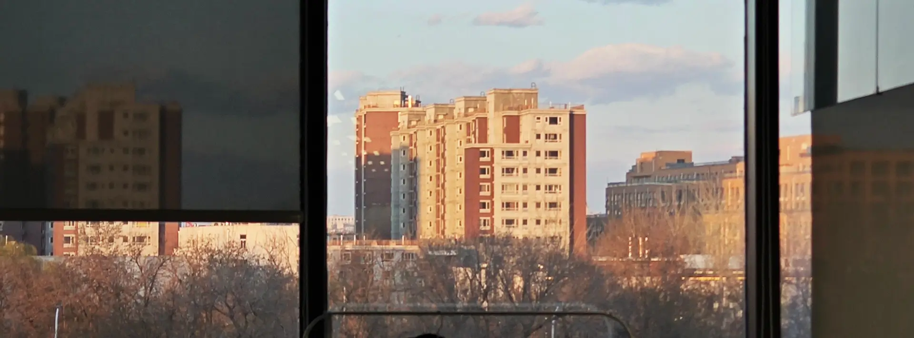

我以前很不喜欢规划、不喜欢把时间分成小格子，掐着表一格一格过；我推崇的是，如果我现在想做，那就该马上去做，而不是把它加到长长的待办事项末尾，等某天打开才想起。学生时代的我，说戒糖就坚持三个月、偶尔写博客就熬到凌晨三点、疫情刚解封先飞去大连，从来自由自在。

但现在不一样。我的一天里，有 11 个小时被买走，以小时为界，泾渭分明。会议要定在某一个点，所有人到饭点统一进食，八点下班才能定加班餐，九点下班打车才能让公司买单。如果这 11 个小时内需要头脑清醒，剩下的 13 个小时也难以有机会，用一个晚上沉浸到游戏，和某个 boss 鏖战，猛抬头才发现已经黎明。

更现实的情况是，自由时间太少、人也逐渐浮躁，以至于连一次只做一件事，都显得无比奢侈。早上必须边刷牙边准备早餐，中午要边吃饭边刷当天的信息流，晚上本该在公司楼下放空，实际总在翻看群聊和预约盒马配送，就连下班后吃点水果的间隙，都要插入没来得及看的视频。

工作让人规律作息，却剥夺人掌控自己生活的权利。我不喜欢工作，却没法逃走，有谁能永远不工作呢？如果人生的后半程都是这样，我仿佛已经望到了尽头。

甚至厌恶工作日都不够堂堂正正，因为那是厌恶自己七分之五的人生。

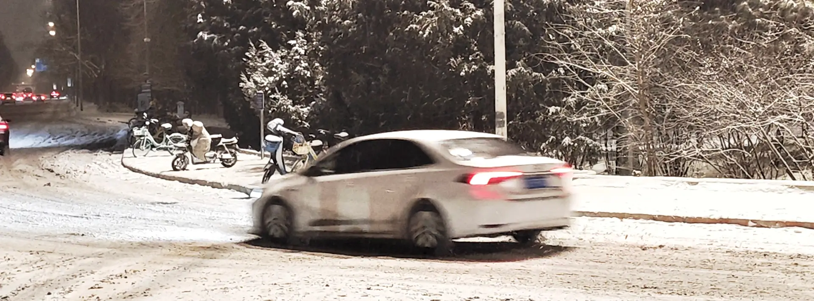

四月末的周四，恰逢 PERSONA LIVE，本来还在思考有什么理由提前下班，没想到右脚开始痛风，以此为借口，我从写字楼逃离，一瘸一拐赶到北展剧场，在场馆外囫囵吞枣地吃掉晚饭，享受接下来两个小时的幸福。

年末某一周，奶冰来了北京。周四下午，和群友们饱餐一顿烤鸭，晚上九点，我们沿着空荡荡的王府井游荡。沿途 Apple 尚且热闹，王府井书店已经紧闭，东堂门口摆上了圣诞树，张灯结彩迎接圣诞，其他的店铺则都在打扫卫生，准备打烊。我们在东堂拍完照刚走出两步，彩灯旋即熄灭，或许今天已经有人记录下它的闪耀，因此它也心满意足。

再一周的周五，北京下起今年第一场鹅毛大雪，整个城市变成嘈杂的空频，拥挤、绵密却安静，只有下过新雪的地面踩上去沙沙作响，用手抓一把都变成挥不走的冰晶。在玉流馆吃过烤肉与冷面后，我们向着望京的方向出发。仿佛回到小时候的冬季，在这样的粉雪之下，我走在群友队伍的最前列，顺手刨了一把雪捏成球，转身砸到悦宝怀里。

「？」

「对不起对不起！」我赶紧凑上去把雪拍干净。

走过路口，我顺手又刨一个雪球，旁边的奶冰见势不妙，往后退了几步，和群友们站成一道墙。我靠近，墙也顺势溃散，涂涂蹲下捏雪球，奶冰再退两步，只有悦宝还在原地。「我和悦宝结盟！」我这么说着，把雪球交到悦宝左手，刚转向其他群友的方向，后颈猝不及防被悦宝右手塞了一把雪，冰得我缩成一团，直接投降。

送走涂涂后，剩下的我们定了一小时电玩间，在附近一座公寓楼的沙发上挤在一起，紧张刺激地玩了把《马里奥派对》。结束已是十点半，初雪在深夜依然纷纷扬扬，西向的 13 号线早已停运，我和奶冰在阜通站道别，等一辆公交车载我去三元桥，坐上末班地铁作为归途。

这几个夜晚尽管短暂，却让我难得感受到，原来工作日晚上可以这么多彩，只要愿意，我总能有机会喘口气。这个选择一直摆在我面前，只是我一直害怕他人议论与工作压力，一直自我掣肘而已。这七分之五的人生既然总是要过，不如就从现在起，试着在偶尔拥抱生活的夜晚里，忽略排期、结论与意义。

## 你有照顾好自己吗？

说来惭愧，今年一整年，总共只回了两次老家。

除夕当天，夜晚七点半才抵达老家高铁站，穿上睡衣，和一家人久违地坐在一起吃年夜饭。初二上午回乡下，下午进入闲暇，初三上午陪家里人逛商场喝茶颜，下午约高中同学们吃顿饭，初四修整一天后，初五和闺蜜下顿馆子逛过书店，初六我就已经回到长沙。

端午节更加短暂。同样是周六晚上七点半抵达，在家刚吃完饭马上被约出门，边和打工的闺蜜聊天边等其他人时，也定下周日早上出门嗦粉。第二天，和闺蜜在星巴克坐到接近中午，又被家里人拉去商场，甚至还没来得及回乡下，一觉过后我又回到了长沙。

不像学生时代总有几个月得闲，进入工作后，回家更像是度假，每分每秒都要精打细算。见到了哪些人、还要做哪些事，本应放松的假期却不敢有一点浪费，错过一次就是一年。

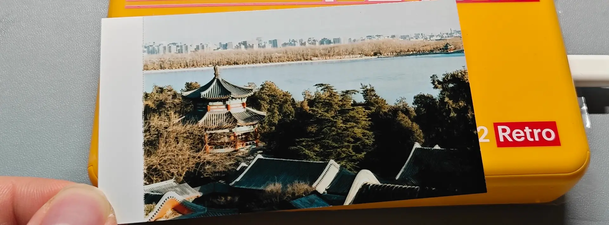

尽管距离遥远，我和爸妈每周都要打一通视频电话的约定，从大学时代延续至今，我们会趁着这个时机，分享各自的日常。

三月，我妈生日前夕，我买了台便携照片打印机，把我拍过的、她的所有照片打印出来，用一个小袋装好塞到包装盒里，假装它全新未拆封，连盒子一起寄回老家。生日那天正好周末，来庆生的所有客人都离开后，她和我打着电话，说要拆给我看。

刚打开看到的是本体，她开心地拿到镜头前给我展示。我：「那你接着看盒子里面嘛。」

她拆出了装着照片的小袋，问：「这是什么啊？」

「你看了就知道了。」

她于是把袋子拆开，把里面的照片取出来翻到正面，我大学最后一个寒假里拍下的她，映入她的眼帘。她一张一张往下翻，见到一张比一张年轻的自己。从我高中某个中秋，她站在外婆家附近还没建好的高铁线下、对着我的镜头比手势，到初中某个午后，我们吃完午饭、她躺在家里的沙发上小憩，一直到十年前，我们在爬老家一座小山，穿着粉色大衣的她，飒爽地站在路边的石头上。

那一瞬间，她脸上的笑容逐渐隐去，仿佛在克制自己的情绪。给我展示过她拿到的照片，过了似乎很久后，她说了一句：「崽，妈妈爱你。」

「我也爱你，另外你记得多打点照片啊，放在家里的相册里，等我回来看！」

「好，那等你回来给你看！」笑容又重新回到她的脸上。

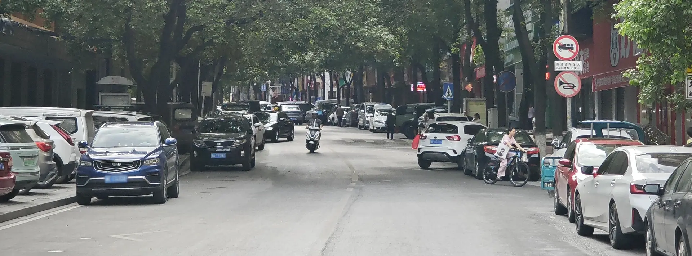

六月中，搬住所后，我和她打了一个超长的电话。我兴奋地给她看我的新住所，看窗外的街景与宽阔的厨房，她说不愧是我，总能照顾好自己，顺势就聊到独立与成长的话题。她说很多家长其实不理解她为什么这么放得下心，她只是觉得我已经有了足够自立的能力。

我长这么大、这么多年，遇到那些问题时：无论是某次月考成绩不好、回家时眼里噙满泪水，还是高中正热衷于模联、被隔壁老师威胁要关社，或者更早一些、兴许是小学，珍惜的模型车被亲戚家小孩打坏，我把所有人关在房门外，自己在房间里哇哇大哭；其实她也很无助，她也不知道应该怎么做，但她知道不能让问题扩大，否则那是帮了我的倒忙。她知道我需要的不仅是陪伴和安慰，更是与自己相处的空间，所以她默默给我端上一大桌饭菜，帮我联系学校老师、给我提供一点底气，在我房间传出的哭声渐小时，拿着她粗糙地用毛线修过的模型车，敲开了我紧闭的房门。

这种心态并非突然产生。她说更早一些的时候，也许是小学一年级开始，当我兴奋地从学校回来，告诉她我今天学了什么拼音、什么汉字，读出的普通话和她的发音不一致，她就知道，她的认知总有边界、她不再是我生活的权威，只能靠我自己，探索广阔的未来，于是给了我许多家庭未曾有过的包容和平等。我可以自由地决定自己的房间装修，自由地选择大学、专业与工作，自由地在全国飞来飞去，前往未曾去过的地方，再靠自己担起生活的大梁。

从我的视角，遇到问题时，总希望有人来帮我解决，在问题当下，心中总有埋怨、不解，但站在数年后回望，会发现正是她这种让我独自面对、解决问题的态度，才让我不再期待自己的问题由谁包办，才真正自立、真正认真对待生活。

更何况，事到如今再回望，那些挫折无非就是人生路上的一块小石头。我向前走的时候不小心磕到、摔了一跤，当时伤得很深，觉得仿佛天昏地暗，要花很久才能愈合；数年后，也许还有疤痕残留，不过大概率只会笑笑，想起来还有这么段有意思的往事。用她的话说，「当我把事故从容地用讲故事的口吻说出口」，实际上就无关紧要了。生活还在继续，总要向前走的。

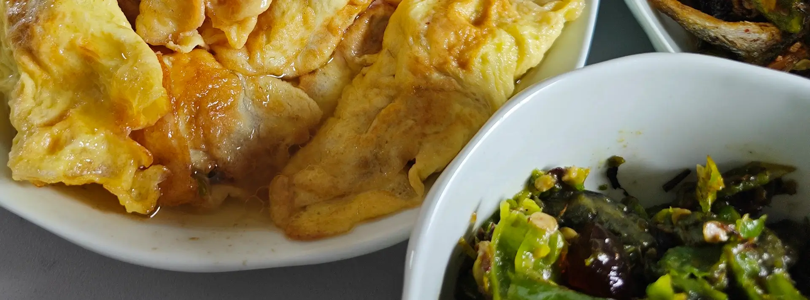

八月，她请了一整周年假，说要来北京看我。她坐上高铁那个周五，我去北京西站接她，在出站口等了许久，才看到她矮矮的身形，用大包小包拎着我想念的草鱼、土鸡，被淹没在出站口的人潮里。我陪她坐着漫长的北京地铁时，其实是有点坏心思的。「这样总该对北京祛魅了吧？」「这就是真实的北京生活呀。」我这么想着。

当她在地铁里牵起我的手，我觉得仿佛置身于注视中，既没有握紧，也没有松开，而是在脑海里想，如果她和以前那样，问我别人会不会看我们幼稚，我该说什么呢？是说「在这里可没有人在意这么多」吗？

如同暑假般的，我在房间吹空调、她在客厅和厨房忙里忙外的周末，转眼就过去了。周一午休，我趴在工位假装睡午觉，却忍不住偷偷流眼泪。周末结束得这么快，我好像没怎么陪到她。矮矮的她，勇敢地一个人从家坐高铁，远赴数十年没有来过的北方，明天，还要一个人离开、在天津待上两天，再一个人回家。

难怪她说，我一个人、第一次来这座这么大的城市，就能找到我要去的地方，真的好厉害。我以为这不过是对自家孩子的小小夸赞，转念一想，她那么勇敢地来到这里，还带上了那么多东西，不由得感叹，其实她也很厉害。

我也逐渐想通，她在地铁里牵起我的手，不是件多么大的事情。或许我该说：「让他们羡慕去吧，多少人想牵住爸妈的手都牵不到了」。这不正是我的幸福吗？

她在北京最后一天，碰上室友下午请假，给室友做了一大桌子晚饭，还备好了我的份，作为我九点下班的夜宵。吃完依旧美味的蛋饺、喝下玉米排骨汤，我拿出自己买的小小蛋糕，和她一起分享，一边把蛋糕大口大口往嘴里送，一边说：「我真不知道，是因为我生日那天加班到十点、没吃到蛋糕，还是因为工作太辛苦了、需要一点糖分和多巴胺，我这半年总想吃各种蛋糕，把小蛋糕买了个遍。」她赞同：「是啊，你连生日快乐都没听到，真的好辛苦。」

泪水又开始在我的眼眶里打转了。我强忍着，说：「那你要珍惜我还在北京的日子，不然等我被裁了，我可就要天天在家啃老了。」

而她莞尔而笑：「那你回家吧。等你在这里待得难受，等你找到更好的机会，或者只是想休息了，那就回家吧。」

我多想回家啊。

等我吃完小蛋糕，再送她去酒店，她牵上我的手，我也顺势牵住了她。这就是我的幸福了吧。

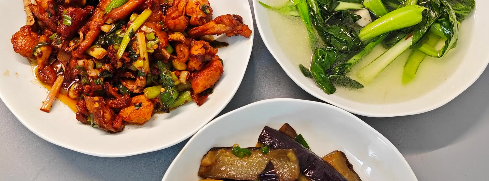

像许多传统家庭一样，今年我爸和我依旧沟通甚少。往家里打电话时，我一般打给我妈，视频那头我爸经常不在家，要么钓鱼，要么喝茶。她会吐槽我爸，说特别爱出去玩，而且不想带她一块，「嫌弃我抢了他的牌打」。有些时候，我妈又会说，「其实他也总念叨你」。倘若我爸在家，聊完日常后，我妈会把他拉到镜头中间：「这不是你天天念叨的崽吗，怎么不来跟你崽说两句话？」

起初其实有点尴尬，我们鲜少独处、没什么共通话题，我也不习惯和他分享，只能翻来覆去地讲讲饮食与日常。即使是二月，他出差来北京，我们坐在涮肉店里，仍然词句寥寥，无非关乎京城与味道。

八月，我妈离开北京前，给我留下冻好的包子、蛋饺、没来得及炖的土鸡。一直冻着不是个办法，我硬着头皮自己处理。一开始是简单地蒸点饺子和包子，后来我买来自己想吃的菜，真正开始学习猛火爆炒，一做就做到了今天，连我自己都不敢相信，以前在家只偶尔下厨的自己，居然练出了工作日半小时端出一顿饭的本领。

我和我爸的关系，在此之后更加紧密。他会教我他拿手菜的食谱、告诉我家里寄来的鲮鱼和紫苏辣酱的吃法。我买到一言难尽的食材，打电话时提到，他也会在角落里哈哈一笑。味道是乡思的纽带，跨越千里，将我和家人连在一起。

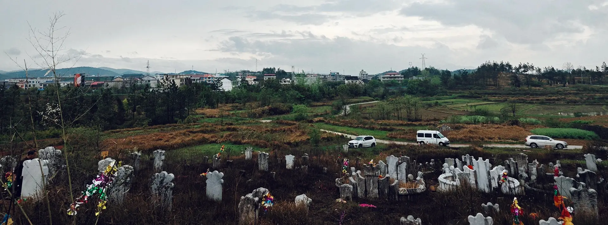

年末，看完何卡飞老师的 [《每一杯好咖啡都是节日。》](https://www.bilibili.com/video/BV1CgyuBkEj8/) ，看到片里照顾老年痴呆的老妈的摄影老哥，看到他们喝一杯难得一见的好咖啡，吃一顿许久没做过的扣肉，看到老太太虽然说不明白个中滋味，喝完咖啡却止不住地砸吧嘴，镜头里的人坐在一起哈哈地笑，我却在屏幕前，回想起了我同样老年痴呆的外曾祖母，默默一个人流眼泪。

我对外曾祖父母只有稀疏的记忆，很多事情都是从我妈那里听来的，比如我妈作为家里最小的小女儿，一直不怎么受外公外婆待见，是外曾祖母教会我妈「洗碗洗底宫、洗脸洗耳朵」，外曾祖父如果有什么好吃的好玩的，也都会照顾我妈一些。

但外曾祖父在我刚记事的时候就走了，我对他的回忆只剩下水泥地旁的土坑上，一把火烧得干干净净的纸房子。外曾祖母要长寿些，一直住在二婆婆家隔壁一间小小的屋里。我对她的印象也很淡了，只记得在我小的时候，每次我妈带着我去她家，她都会给我塞几块裹满了糖、甜到掉牙的饼干，我会吧唧吧唧吃完，趁着我妈陪她说话，跑过她家后面一条小道，跑去二婆婆家找表妹玩。

我的学业逐渐繁忙的时候，我妈告诉我，「她痴呆了」 。那时我只有过年和长假才会回乡下，我妈还是带我去她家，她记得有个曾外孙，看到我却眼神空洞，认不出来了。我妈告诉她，那个曾外孙就在她的面前，她会伸出皱皱巴巴的手，想要抚摸抚摸我，但我多是礼节性地寒暄几句，然后再跑去其他地方，留我妈独自照顾重新变成小女孩的她。

接着我就上高中，连长假都很少，一年只有过年才有机会回乡，对大部分亲戚的回忆，停留在高中之前。对她来说，这一停留就是永远。某一个春天或者秋天，她悄悄地离开人世间，去找她的老伴去了。

可能是家里人怕影响我的学习，我对她的白喜事没有很深的记忆，高中的时间一天一天地过着，我就这样一点点把这段回忆忘记，只记得在某一次回家，只能看到她的黑白照片，挂在那个空荡荡的堂屋里。高中毕业，我到长沙读大学，不知何时二婆婆家里改建，连着她家一起拆掉，再到现在我在千里之外工作，不仅那条小道不复存在，连她的黑白照片，我看到得都越来越少了。

事到如今，我的外公外婆、爷爷奶奶，也到了可以做曾祖父母的年龄。他们现在还很健康，我希望他们永远健康。可是会不会有一天，他们也变成小孩？会不会有一天，等我终于结束工作、赶回家想陪陪家人，推开家门，却只看到堂屋里高高挂着的黑白照片？

到那时，我又该如何像我妈那样，将这样的感情压在心底，平淡地告诉别人，「TA 痴呆了」、「TA 离开了」呢？

## 你现在在做什么呢？

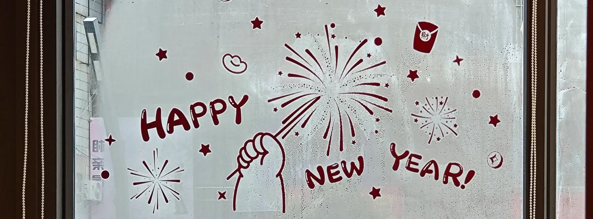

今年元旦，和对象共同度过的假期开始倒数，从深圳告别朋友们回到长沙，一起吃新年第一顿转转热卤时，店里唐突地响起了《First Love》。听着歌词「明天的这个时候 / 你会在哪里呢」，我也隐约带了点悲伤。今晚我就要北上，而明天的这个时候，我只可能是在工位，怀念着短暂的假期时光。

尽管分别已经成为日常，可当我知道上班后第一个春节，我们只在年后才有一天多相聚，我还是抑制不住自己的失望，在寒风刺骨的大街上，冲屏幕另一头的他自暴自弃，细数我的期待与怅然若失，仿佛是怨恨他还没有竭尽全力，或者是在怨恨被工作裹挟的自己。

当我对上他的眼神，刚刚的怨气又烟消云散。我突然意识到，在他的回忆里，我们在一起的时间总是工作间隙，只是今年我才有这种感受而已；在新的日常面前，怨恨亦无意义，因为时间短暂，所以才更要珍惜。

过完年，一整个月的忙碌后，终于有空回家找他，仿佛已经过去了很久很久。再一个月的清明节，他来看北京的春天，看颐和园茫茫人潮，看电车从巴沟站驶入桃花海。听人说上班后，逐渐把日常过成了盼望，盼望着休息、周末和下一次假期，甚至学生时代的漫无目的，在上班后看来都不可思议。我想我也是这样，只不过在这些日子之外，还多了一些偷偷的期待，期待着每月总有那么一两个周末，我和他一起度过。

怀揣这种心情的我，逐渐习惯了动卧上的风声呼啸，习惯了走进一个陌生的车厢，熟练地摊好床铺后入眠，待到清晨，再随熙熙攘攘的人群，像沙丁鱼一般挤进地铁，麻木地进入下一个日常。他也逐渐习惯像我一样在周五下班后，赶到机场坐上飞机，奔赴短暂的重逢，再在仅仅 48 小时后，被我目送着走进候机楼。连分别的鼻酸都被疲惫冲淡，这就是我与他全新的生活。

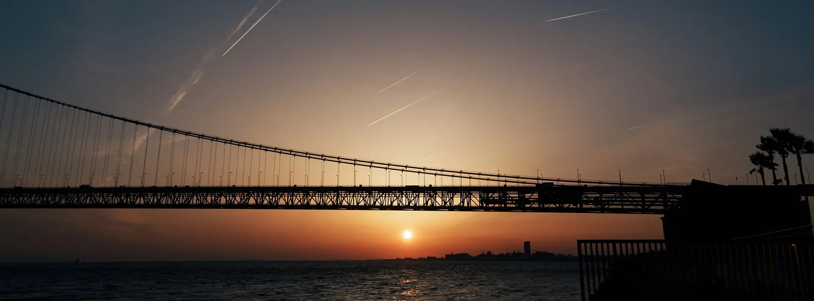

失去了学生年代那种肆无忌惮的我，直到五一才终于找到机会和他一起，在上海与朋友们小聚后，飞到另一片遥远的土地。坐上机场的摆渡车，闻到海风吹来的气息，经历冗长的入境手续，恍然间已经置身神户。

抵达日本第一晚，在大阪 USJ 环球塔放下行李，还没来得及休息，就赶紧出发，奔赴难波的商业街夜景，第二天顶门冲进任天堂园区，在奇诺比奥、耀西、咚奇刚的簇拥下，和他度过梦幻般的一天。

第三天再回到神户，探访神户三宫与北野异人馆、吃一顿正宗的神户牛肉。下午的后半段，我们前往舞子，在蔚蓝的天空下跨过铁路道口，走上似乎直通海底的公路，在明石海峡大桥下，沿着海岸线一路漫步。直到天色渐暗，我在海边的售货机投下硬币，买一听可乐边走边喝，望着太阳逐渐被海面吞没、遥远的天边染上一抹深蓝，他狼狈地在风中捂紧外套。落日、海风，波光粼粼里和他站在一起，或许就是这趟旅途的珍贵回忆。

去过世博、京都，在日本的最后一夜，我们鼓起勇气，预订了本地居酒屋。店不大，中间一个吧台，打着昏黄的灯光，内部是忙碌的老板，外圈仅能坐下五六个顾客，菜单都只有一份，用一个文件板夹着，还有手写的今日特别推荐，和菜单夹在一起。店家不懂英语、我们不会日语，不过居然很顺利地完成交流，除菜单外甚至连翻译器都没用，全靠双方心领神会，我们就这样点了薯条、唐扬鸡块、青椒酿肉、烟熏牛肉、当日最后一份巴斯克蛋糕，以及连着续了几次的朝日 DRY ZERO。

饱餐一顿后，我们不确定店家准备何时上甜点，猜想店家或许在等我们结束用餐，于是准备问问看。这一问，就问得很艰难：点单可以靠これこれ，买单也多半听得懂 check out 和 cash，但这么复杂的句子该怎么表达呢？

我：「呃…when will…呃…巴斯克…（气急败坏打开翻译）呃…」

好在旁边热心本地人这时挺身而出，将我蹩脚的英语翻译为日语、由他和店家沟通，沟通完毕再向我们转述店家的意思，这才救我们于水火之中。

在回上海的飞机上，读着《离岛》，我再一次感受到，或许这就是一期一会的含义。我第一次真真切切地踏上了异乡的土地，感受另一个时区的风景，还鼓起勇气，顶着语言不通和人交际。雨中京都、神户日落，对于我们来说，也许就是这辈子都不会再见一次的风景。很多年后，当我再打开相册，看到那天舞子的日落，想必又能回到那个傍晚，在橘黄色的落日下，和他一起站在海风里。

以前我很喜欢独自旅游，认为这样更加自由，可时至今日，和他在一起这么久、旅游过那么多次后，再也无法否认，和喜欢的人出行，真的是完全不同的体验。我的每一句感慨都有人倾听，每一个提议都有人回应，因为他在，我能勇敢地变得外向，即使闹出洋相，也能和他一笑而过。

可惜假期实在太短，抵达浦东后，我们就要分离。

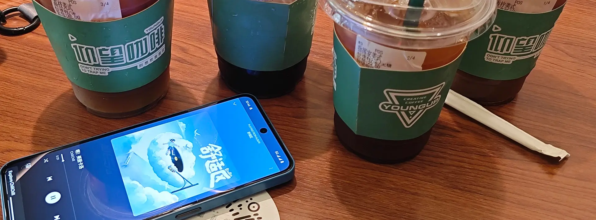

八月初，头头和虎子来长沙找我们玩。上次见面已经是一年以前，我本以为多少会有点疏远，不过在和他们见面时，我以大大的拥抱迎接，然后度过了无可比拟的两天。在茶颜饼坊大肆购入美味又实惠的烘焙，喝一杯打满氮气的鸳央咖啡，太阳未落时赶赴夜市吃个飞饼，再到县正街匆匆嗦碗粉等月亮高悬，最后以一杯黄油啤酒结束珍贵的一天。

当然，最珍贵的莫过于身旁的好朋友。我和头头其实 23 年初才认识，满打满算也不过两年半而已，但彼此却已经相当亲密。我们认识时，头还在重庆、还在准备毕业季，我则在追寻自己曾经的私心，聊天框里一来一回，互相吐露过心绪、分担过压力，就这么逐渐熟悉，我也从羡慕虎头的感情，到有了自己的安心，再到开始异地，感慨还是佩服头头的勇气，能只身前往另一座城市，和喜欢的人待在一起。

周日吃过一顿鲜美的鱼丸，短暂的两天即将终结，送他们去地铁站的路上，我不再害怕疏远，反而带着一点惋惜，开始期待下次再见。或许亲密的朋友就是这样，一年到*头*见不到几次，忙起来的时候也不一定记得聊天，可待到碰面，总能以最轻松的心态，聊聊对方的日常、改变与悲欢。

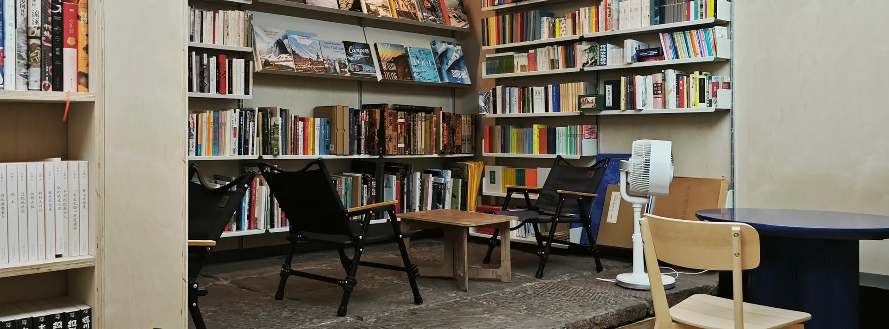

国庆节假期，我们去了成都。第一天晚上，被太古里的熙熙攘攘震撼，我们转头拐上小路去地铁站，恰好偶遇了「浅礁书店」。第二天离开杜甫草堂，我们直奔「再书房」，这名字相当贴切，没有一本书封上，只要乐意都能细细阅读，正像自己家里的书房。于是我们各点一杯咖啡，花了接近三个小时，徜徉在店家的私藏。

第三天更是收获意外之喜，原来我们计划了去都江堰的行程，早上起来发现抢到了高铁，却忘记抢门票，只能去备选的天府美术馆，这一去就*邂逅*了《远方的邂逅》，来自意大利都灵，策展人用好几个主题，将知名的现当代艺术流派精心编排到一起，设计得相当用心，以至于我频频感叹，如果没有因为错过都江堰来到这里，或许真的会捶胸顿足、大呼可惜。

美术馆、独立书店，不是热门旅游目的地，却是我眼中城市喧嚣外的第二重呼吸。这是成都对我来说的意义，我很庆幸有他陪着我一起。

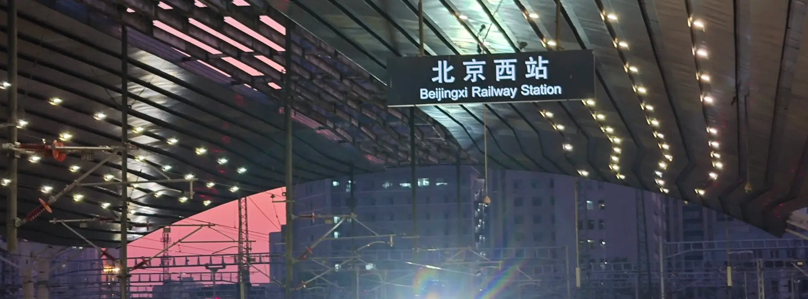

但我又要回到北京了。八月中旬，某个夏天，午觉刚睡醒、意识还模模糊糊，我似乎听到过去和他闹别扭的声音，却在彻底清醒后，感到无比陌生。偶尔跨越一千公里相见，更像是度假，没有生活的鸡毛蒜皮，只有 48 小时用以珍惜。等魔法的时间结束，我从动卧上醒来，看到北京熹微的晨光，又会进入下一段黯然神伤。

我和他的联系，从小小的一居室，变成了遥远的一千公里，从接他下班再去吃顿大餐，变成了每周公式化的几个电话、一场电影。在我们都忙起来的时候，甚至可能一天发不到几条消息，唯有异地变本加厉。

十一月某次回家，和他走上长沙老城区的马路，聊到我和他刚刚在一起时，在国庆和学长们小聚，我曾骑车路过这里，这才惊讶地发现，那居然已经是两年前的事情。回到家里，梳妆台上放的洗面奶、护肤品，不是已经用尽，就是即将过期，但它们都还放在那里。每次把它们拿起来，我都会想起两年前那个懵懂且幸福的冬季，工作有了着落、心也有了寄托，不需要焦虑、没什么压力，只需要学习怎么和他在一起。

再等几次昼夜更替，我又要进入另一个冬季。这个冬季没有雨水、没有绿意，没有裹挟进被褥的潮湿，只有光秃秃的枝丫、将发未发的新芽，深呼吸时如同刀割的空气。

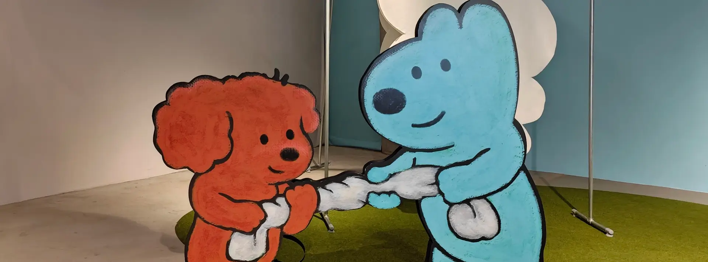

回头看我们之间的关系，似乎比起情侣，更像是最好的兄弟。以前的我对感情懵懵懂懂时，还不知道什么是喜欢、情侣应该有什么相处模式，直到自己真的谈了两年恋爱才知道，情侣关系本就没有标准的式样，只有磨合好的日常。

对我来说，我没有必要非得腻着他、到哪都黏着他，也不习惯在面对他时突然换一副面孔。在平淡的日常里，我会和他一起出门吃饭，一起逛商场、美术馆，一起听 live，跟他开没品玩笑，听他讲同样没品的笑话。熟悉我的人知道，我对谁都是这样。他并不是所有人里，最能接住我的梗的那个，也不是和我共同话题最多的那个。

这么说，他好像没理由和我在一起。

但梗不是爱情，共同话题也不是。这段关系走入第三年时，相敬如宾的距离早已磨灭，剩下的只有无间的亲密。我和其他不太熟的朋友单独相处时，还会感觉很有压力、担心会不会没有话题，唯独和他在一起时，不需要害怕安静，什么都不说也很好，那样也是充满了幸福的时光。

在我们异地的这一年半，没有必须秒回的绑架，也没有随时随地的视频电话，我们都希望对方平衡好生活、照顾好自己。偶尔他太久没回消息，我也会有点焦虑、有点好奇，会问他「你在干嘛呀」，等到他终于回应，我就能继续安心。

而许久未见后、再次见面前，的确会隐隐约约觉得，好像生活被打断、害怕我们已走散，但在我见到他那一瞬间，那些担忧总是烟消云散，我会回忆起，自己其实早已知道，他就是特别的存在，这份感情与相处模式无关，只关乎毫不动摇的喜欢。习惯异地的当下，似乎曾经担心的遥远距离，其实也没有那么可怕，以一句「我会一直很想你」在高铁站拥别后，我已开始期待下一次回家。

## 而我又在想什么呢？

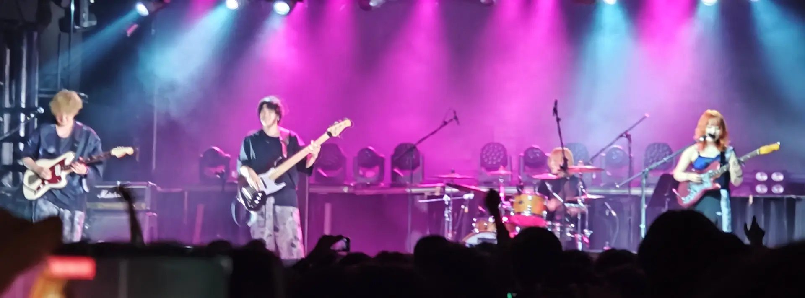

今年的总结，似乎少了些「总结」该有的味道。我从不曾像今年这样，一点鸡毛蒜皮的小事，都能发散出一大段思考，以至于行文至此已近万字，却依旧漏掉了许多细节。

例如，今年除了 PERSONA LIVE 外，还去了水中スピア和 H△G 的 live，两场都非常喜欢；但更多的是遗憾。遗憾 mol-74 的解散、遗憾 Fayzz 买了票忘记日子、遗憾 Diels Alder 在长沙时我没回家、遗憾 She Her Her Hers 干脆错过抢票。

又或者，我第一次参与手机众筹，预定了 Unihertz Titan 2、从年中等到年末，本来还想写篇评测，可我使用一段时间后便宣告放弃，认清了实体键盘被淘汰必有原因，现在它放在抽屉，而我已经开始考虑把它挂在闲鱼上交易。

再比如，身在大家使用「同学」互称的互联网大厂，我今年终于不再有同学了。我的学生时代已经远去，就连回忆都在消失，以至于我频频感叹，大学四年仿佛是一场梦，梦醒时分，所有的美好都不再真实。

但在此期间，与我真切生活过的那些人，真实地存在着。

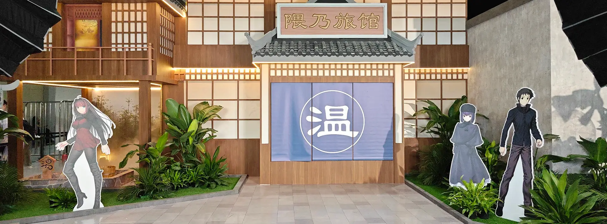

八月，和高中时代的挚友们，在一个周末去了趟杭州 FES 2025。我们起码已经半年没见，见面时却依旧默契，仿佛从不曾分离，仿佛昨天还在一起。我依旧能摸他们的头，依旧能边喝酒边讲笑话，也能在酒店床上躺得四仰八叉，互相吐槽对方玩的游戏不行、对方的 B 站推荐真的很没水平。

FES 对于我们来说，也已经变了一层含义：一整年下来，只在这天，我们既有理由，也有动力，从全国各地出发，再次聚在一起。它是学生时代残留的碎片，松弛、自在，一如漫长而慵懒的夏季。

周末很快过去，我的疲倦与怀念，则比以往都要强烈。褪去稚嫩后，仍然紧密相联的我们，都已经迈上了不可逆转的、成为大人的道路。总会有那么一天，他们会成家、会成为世俗的大叔，就连见面时摸摸脑袋都显得不合时宜。

幸好，曾经害怕的疏远与形同陌路，只要我们都不希望它发生，它就不会发生。在高中毕业五年后的今天，再没有月考、补课，也没有鸡尾酒、麓山南路和期末周，但我们关注着相同的游戏、分享着各自的欢喜，如同我们依然在对方生活里。

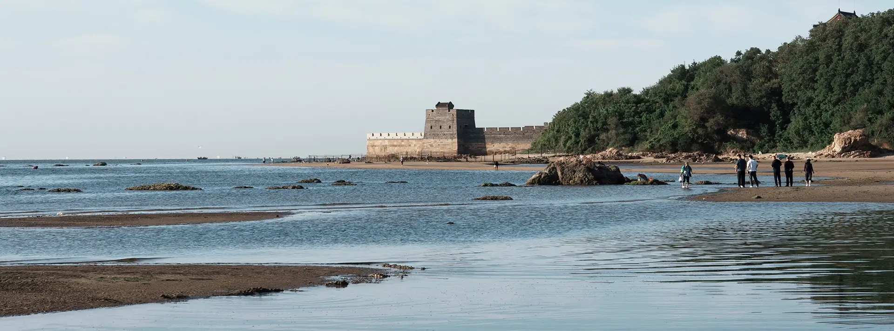

九月，大学室友回山海关老家，我顺势跟着那句「这么近那么美，周末到河北」的宣传，坐上几个小时的高铁，奔赴秦皇岛。吃过浑锅，我们在乐岛看海豹拍打圆滚滚的肚皮，登上大摆锤承受加速度给全身的压力，临近日落再到山海关古城吃顿烧烤，等第二天起来赶海，从船厂一路走到老龙头，捡拾吐气的扇贝，避开搁浅的水母。末了，在离开前夕，登一次角山长城，俯瞰整个山海关的风景。

说来惭愧，我身边大多数人，都是选好一个方向持续精进，但我的人生道路从未坚定。比起在同一根轴线上不断挑战高峰奇境，攀登珠穆朗玛、多洛米蒂，我更乐意今天登上触手可及的山海关顶，下次再回一趟岳麓山，和朋友们站在一起。

我做不到遇到什么都迎难而上，假如某天实在不喜欢这里，不如就直接逃去别的地方。即使爬到爱晚亭就鸣金收兵，至少见到了不一样的风景；即使被指责软弱，软弱也是我的人生底色。

唯独在这点上，我仍旧、并且希望一直保有学生时代的自由与放浪。

即将 23 岁的前夕，当我看到信息流里大学生、高中生，看到身边新入职、仍然朝气十足的实习生，我切实感受到，我的眼神不再澄澈、我的精神不再年轻，即使我自由并放浪，那也反映了我 22 年的人生历程。道路在脚下分叉，时间在不断累积，不变的是，我依旧希望自己有选择道路的勇气，依旧希望自己带着热忱，在时间的山海前行。