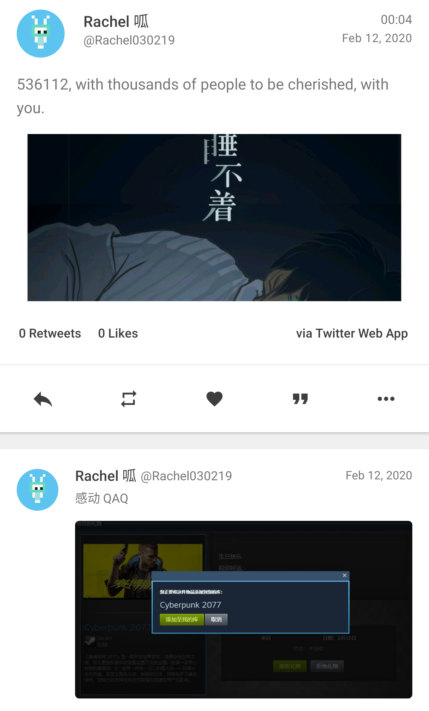
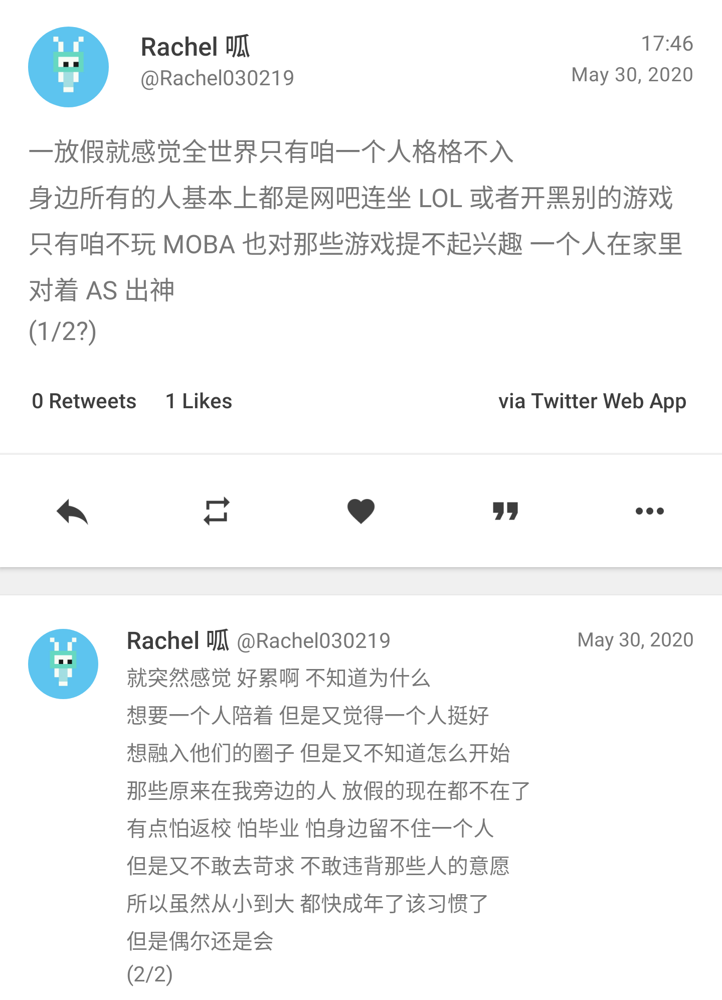

2020 这一年过得太慢，令人不快的事从未终结；2020 这一年过得太快，仿佛还没有开始便已经结束。

辞旧迎新前，我于此留下追忆与展望。

因为一些私人原因，今年的年度总结不会在博客首页上公开，内容和以往也将不同。正如标题所述，比起罗列过去一年的所见所闻所学，今年 Rachel 更倾向于写下对过去一年那些难以忘怀的事的回顾，和一年将逝时的朝花夕拾。

过去一年，有落寞也有幸福，有深思也有轻浮。既然在读 Rachel 的故事，那就听听 Rachel 自己的描述吧。

> 本文长约 5900 字，全程带图，阅读约需 15 分钟。

## 一月 / 怀揣着朦胧的向往

以前，自己狗粮被喂得不少，身边脱单的人不少，一直喊着羡慕，始终不以为意。当我相信抵御狗粮的抗体已经在我脑内产生时，本就不多的小小坚强，在大年初四顶着疫情同友人逛了一趟超市后，被击垮得连渣都不剩。

那是我在身边第一次见到同性伴侣，也是印象最深刻的一次。曾只是将人放在心上的我，第一次知道被人放在心上有多美好，知道原来人人都有爱得这么放肆，这么蛮横，这么甜美的资格，让一个以为自己已几近放下类似感情的人重拾渴望。

除此之外，懵懂无知的我，那一天第一次知道，原来真正打动人心的从来都不是海誓山盟，不是巧言令色，而只是平时看来微不足道却能折射出浓厚思绪的某一瞬间。就像…

## 二月 / 灯影繁忙

536112×1000 = 17×365×24×3600.

这是长这么大以来过得最特殊的一个生日。今年没有亲友，没有开学，没有下课前五分钟产生的冲回家的渴望。今年有网课，有老 E 深夜直播的，在寂静无声的深夜让人感觉世界被抽离的 Outer Wilds，有一群让人此生不舍得忘记的人，作为明明第二天还要早起的高三学生，为向另一个高三学生送出祝福熬夜到凌晨，还有 the one whose soul I've always wanted to shed a light on, shed on mine his light in his way. 

在日月交接边际，我和友人打着电话，等待着于我而言全新一年的到来。

「那我挂了去等了？」看着老 E 又一次没能挽救世界毁灭的我，在最后的几秒这样说道。

她听起来很疲惫：「去吧去吧，我去准备发说说，明早我再给你打电话过来。」

23:59 转进 00:00 的那一刻，相较往日还平平无奇。许久未见面、未联系却从未离开的朋友送来了祝福。我欣喜，也还在等，等一个友人嘴里更特别更「走心」的时刻。

于是，00:17，往日的我在 QQ 空间里排开，和另外 8 张好几十个人发来的祝福拼出的长图组成九宫格，伴着友人亲手敲出的数百字的回忆。我一张一张一条一条地读完，仿佛被抽离的世界又围在我身边，将我拥入怀中。从学弟到学长，从身旁到远方，我的半个人生在此时活了过来，带着此前从未有过的欣喜。有些片段洋洋洒洒，饱含真情的文字占据了两个屏幕的领土；有些片段言简意赅，一字一句锤进内心。

这是唯一一次有人特意为我向好几十个人求祝福，特意把所有图片剪下来贴在一起，特意整整推迟了一个小时的睡眠，亲手准点按下发送。我也是唯一一次收到如此特殊的生日礼物。尽管不记得如何与她相识，不记得她如何成为同龄人中与我关系最好的异性，但我知道这值得我珍藏一生。

## 三月 / 青空微凉

网课期间，学校、影院这类场所尚未开放时，大部分商家已投入「复工复产」，包括三月主角 KFC。万物解冻、复苏之际，KFC 推出了春分半价桶，以极其优惠的价格吸引了我和诸多因为网课被迫居家学习的学子。

那天，天朗气清，惠风和畅，翘了物理课跑到大街上的我，隔着口罩呼吸着自由，久违地肆意迈动着长了膘的双腿，径直奔向 KFC。一切都很美好，除了 TeamViewer 的服务器在国内体验实在不佳，让我顺带着物理课迟到，被班主任的短信贴心问候。疫情尚未得到良好控制的春分，或许是因为半价桶让人大呼真香，KFC 的人流量比预想的多了不少，不乏有顾客选择店内就餐。准备就着化学课吃炸鸡的高三学生一点都没闲着，套餐打包好一到手就叫车回家，赶上了化学课前的课间休息，避免了问候短信梅开二度。

如此优惠的套餐当然是选择向同学们宣传，所以就有了后续。想来大家都憋坏了，该「真香」时争相「真香」，我也 ~~因强大的业务能力荣幸~~ 当了一次 KFC 的「自来水」、「产品推广大使（无偿）」。那天下午，按照居家学习课程表，该上生物课的时间，有人在买春分桶；该吃晚饭的时间，有人在买春分桶；该晚自习拍照打卡了，有人还准备跑去买春分桶。这大概就是网课期间高中学生们的真实写照：在那段充实、忙碌又像是一事无成的时光里，唯有混合了愉悦的自由感以及难得又弥足珍贵的休息，求之不得又不可或缺。

## 四月 / 征程与野望

焦虑。

因为找不到努力的方向而焦虑，因为害怕比身边的人落后太远而焦虑，因为考不到想要的成绩、去不了想去的地方而焦虑。

不知道除我之外的其他人是什么状态，至少在返校前最后的假期，这就是我最明显的感受。因为焦虑所以享受不了生活，做不了自己喜欢的事，更不可能好好利用时间。时间利用率低下反过来让焦虑越来越严重，最后到了让人束手无策的地步，仿佛脑子里总有几个念头在打架，精神力被内耗得一干二净。

以前从未有过内耗型人格的自觉，现在回首才发现这种焦虑贯穿了我高中以来的许多假期，尤其表现明明什么都没做还是累到要命，还想回去好好睡一觉。我知道，睡觉不能解决问题，我需要的并不是充足的睡眠，是那种还可以「遇到困难睡大觉」的自己，是活在内卷化日益严重的今天的人在内卷化严重的领域求不得的平静与安宁，是童年一样对未来对明天的的无忧无虑，仿佛只要再过几天又是一年，就这样看着时间一点点驶过。

我还能做什么呢？在那个马上就要进入一段新征程的时间点，与其探究自我不如好好期待。想给许久未见的人一个死死的拥抱，想扑进信任的人的怀里放声痛哭，想走一遍可能再走不了多少次的夜路，想回到学校旁的住处重新感受学校的气息，想重新出发，至少我还能被推着向前。

## 五月 / 钻进现实的逃生舱

不知道该怎么开始，不知道该怎么保持，不知道该怎么结束。

这是我与人独处和写下这些时最明显的感受。

想说说自己以前的事，在键盘上码好一段一段整整齐齐，然后觉得没有必要，看着打出来的字一段一段消失。

可以确定的是，这一年来的自己在这一点上一直没有变过。除非试图接近我的人与我有许多共同话题并且性格相符 / 互补，否则其对我的第一印象想必都脱不了「群体里是沙雕，独处时像冰山」。与那相同地，独处时的冰山不知如何开口，不知如何迈出第一步。

所以会不敢和人单独出门，会特别珍惜身边交好的人，偶尔也会祈求着属于自己的光。

## 六、七月 / 扬帆，不敢远航

出生以来经历的最大事件、决定自己前半生去向的关键、高中三年最大的焦虑来源：高考，来势汹汹、平淡无奇。

以前的我一直觉得高考能左右前程、改变命运，甚至决定一个人的一生，一直觉得高考是天大的坎，直到那一天我终于跨越它，到了更高的地方往回看才知道，没有任何东西能决定一个人的一生。

从不是「泰山压顶而面不改色」那类人的我在高考的前一天晚上，最后一次逛遍家乡最繁华的街道，在一直想去但总望而却步的寿司店大快朵颐，这回忆我今生难忘。不敢说我自己面对高考毫无压力，在高考的战役中我更算不上打了翻身仗。事实是，不管此前有多紧张害怕，以小时为单位的倒计时开始后，那都不再有意义。高考像是一次月考，和月考一样成绩揪心，一样时钟走得飞快，不一样的是考完后肩膀上少了三年的压力，却没有大喜大悲，只是突然很累，而内心平静似水，坦然迎接终结。

我好像走了很远，可在直面它的那一瞬间，记忆中的光突然亮起的那一瞬间，恍惚瞥见自己经历过的每一个春夏和秋冬的那一瞬间，我才知道我从未出发。就像一场电影、一次旅途或一段悬而未决的感情到了终点一样，戛然而止，如梦初醒。不变的是生活，它依然以它不容置疑的节奏，裹挟着每一个人向前。

让人欣慰的是，我到现在还没有成为无趣的大人，还没有失去稚气与好奇，还在孜孜不倦地努力着保持本性。但是啊，如果我真的开始变成无趣的大人，我自己能意识到吗？如果我已经走得太远，我还能记得当初为了什么出发吗？我忍不住这样向自己发问，发现自己已经不知如何回答。

## 八月 / 序章

这是 8 月 15 日的长沙火车南站，我崭新旅程的出发点。独自出游也好，翱翔空天也好，很多个「第一次」像这样交汇，构成去重庆的前奏。

「没有问题的」，我这样告诉父母，这样告诉自己。在我终于得到允许，收拾行囊出发时，才知道不仅仅是「没有问题」。航班延误，我在候机室守在电脑旁不敢小睡；父亲陪着孩子扑在舷窗上看地面远去，我直勾勾地盯着舷窗发呆，直到再分不清黑夜与云彩；深夜抵达山城，一个人推着行李站在重庆北站外的天桥上望着不眠的人群来来往往，望着万家通明，不知去向何方。

孤独之外，独自出游给行程安排提供了最大限度的自由，让我能独自决定去哪，能做一些与人同行时做不到的事，例如面基。一天早上，在魔幻交通城市的魔幻重庆北站，两个体型不小的人见面之前，被「3 号口在哪」这个魔幻问题搞得头昏脑胀。

前一天晚上，Elepover：「我觉得地铁站某个出口可能是最靠谱的…那就重庆北站北广场 10 号线 3 号口吧。」

事实证明他是错的。

第二天我匆忙在楼下的面馆解决早餐，早早地赶往离住处不远的高铁站，准备静候高铁抵达——至少理想是这样的。现实是，我把整个站逛了个遍，然后发出了一声悲鸣：「完了，3 出口在哪？」

虽然我 EX 级的固有技能（指路痴）突然失效，意识到什么后跟了一句：「不对我好像是从 3 号口进来的…？我现在应该是在 3 出口的这个出口里面？现在走出去会不会很丢人啊」；对另一方而言就不一样了，因为接下来我收到的是：「我带你们打，我找不到三号口」。

坎坷的见面并没有浇灭我们的热情。那天，不久前还被太阳炙烤着的重庆难得地收敛，我们也藉此享受了几乎整个白昼，直到日落。

当然，这段旅途并非从此开始，亦非于此终止。与 QuantumAlgorithm 在观音桥度过的半个晚上，同另一位推友首度探访的吉野家和 maimai 在让人难忘上同样不遑多让。感谢他们的陪伴与大度，这次旅途的目的成为了面基，原本没有计划的出行填满了欢喜，本文也忠实地记录了回忆。

## 九月 / 无奈中将身形隐藏

最难受的那些日子里，我翻来覆去地听着 KATE 谱写的《甘い痛み》，把不知因何而发的感受挥笔写下，或许是告别过去，或许是告别自己，或许是告别我曾经以为会一直在我身边的他。

我至今仍记得我们共享的愉快与痛苦，小鹿乱撞与如释重负，记得我在他最深的梦里，和他一起在小城的街上寻找终究找不到的东西。我把写下的文字录音、配乐，犹豫着是否公开，最终还是选择了把往日的回忆交给尘灰。成品存留在我硬盘里的某个角落，如果想的话总能找到，但事到如今，不如将它作为从现在寄给未来的记忆碎片，留给更久以后的我。至于那个我会选择嘲笑还是怀念，我也无从得知了。

我以为我足够坚强，直到我双腿发软，找不到离开的方向。我以为我可以忘记，直到那天晚上入梦前他抢走我的鲨鲨，我从背后抱紧抱着鲨鲨的他；直到踏进另一条河流前我把他送到车站，不知从何开口又不愿让他离开，以拥抱送别；直到今天我想念着远在半个中国外的他，幻想着可见未来里的重逢与相拥。

即使重逢，我只会是他的挚友，我也已满足于成为他的挚友。守望化成厚重的夜色，包裹着失落、怅惘与决意。

## 十月 / 我爱着落日那一方

思乡是逃不掉的指控。

军训期间的时间很紧迫，每天大清早爬起来随便买点东西开启一个上午的训练，中午匆匆忙忙吃过午饭小睡一段，有时连外腰带都没有解开，一个小时的晚餐时间结束后还要训练到至少九点。即使强度已远不及往年，只是这样就已经让我身心俱疲。

生活没有给人喘息的间隔，我也不习惯在他人面前表露感情。感情被有意无意地压抑时，与人一边聊着生活一边望着平静的湖水和星空，总会想到未来，想到以往，想到不知还能回几次的家，想到走过无数次的回家路，想到或许再难踏上同一寸土地，想到故乡的风与云，想到仰起头就能看到的高悬的明月，想到矮小得难以被称为山的土丘与永远那般湛蓝的天空，想到从小到大在故乡度过的夏天，和那些夏天里家人永远会给我买的、一成不变的冰西瓜。

人总要前行。和难以忘怀的挚友分别，就像回到了高中的那些秋日，在周身渐凉时用一杯暖和到烫嘴的燕麦牛奶作为回应，小心包装好易碎的情绪，抹平湖水泛起的波痕，心知至少这次不是独自出发。

## 十一月 / 满月，格外荒凉

…就像我也曾那么坚定地相信，我曾被放肆、蛮横、甜美地喜欢过。

在我还这样相信的时候，我也有犹豫，有怀疑，有认为我一直在欺骗自己，直到某天晚上的梦里，梦见了与那个人手心相对，十指相扣，朝着光照来的方向，不再分离。

在那不久后的某天晚上，我终于鼓起勇气表露心意，然后只想从话筒旁遁形，把手机连同回忆沉入大海，假装一切未尝发生。

我也曾那么坚定地相信，我能够放下痛楚，直到我被自己的回忆淹没，不愿沉溺，也不愿清醒。以前一直不知道何谓「既视感」，直到点开曾经循环的曲库，发现每段旋律响起时，脑海里浮现的那个转角、那瓶饮料、那句誓言和那段从踽踽独行到有人陪伴再到踽踽独行的夜路，现在看来如此清晰又如此遥远。我企图沉溺其中，最后只是让那般光景被逐渐磨灭，由新鲜的记忆取而代之。

后来我才知道，事实并不会带来悲伤。真正带来悲伤的是那条无人陪伴的街道，那张被藏在相册里偶然翻到的做过壁纸的照片，那首与人一起反复听过从未听腻的乐曲，和那些曾打动人心的、折射出浓厚思绪的瞬间。

## 十二月 / 让我成为他的光

有点自私可能也有点难以理解，对我而言，确实存在关系凌驾于恋爱之上的人。

我以为我们永远只是好友，就像他永远会躲开我摸他头的手，直到那些他最难熬的日子里，我知道了他的失眠、空虚与孤独，选择陪在他身边；直到那最后的数百个晚上，我和他一起离开学校，目送他坐上回家的车，然后绕远路散步作为归途；直到我生日那天，收到始料未及的 Cyberpunk 2077；直到我偶然知道，原来我是他那么多好友里唯一的置顶，是他那么多琐事唯一的吐槽对象，是唯一花掉一个白天只为见他的傻子。

直到生命中那么多重要的节点，我们一起度过。

我曾经也是习惯一个人的人。我知道自己很无趣，知道自己很难习惯和人相处，知道只有独处才能让我回复精力。

但他成为了我的光。他让我知道，原来与人一起可以很开心，原来我可以多一点放肆少一点拘谨，原来不用在意别人怎么看待自己，原来幸福是永远都有人站在自己身后。

一直以来，我感谢人生中有他的参与，也希望能一直陪他走下去。某天晚上，当他又认为自己无能时，我想告诉他，有些时候他以为自己什么都做不到，事实上他已经做到了没有人能做到的事。我想告诉他，他受人欢迎不是因为他是萌新或者大佬，是单身或者已婚，而是因为他是他。我想告诉他，不管未来如何，他一直都会是那个他，也一直会有人愿意站在他身后。

我想告诉他，让我成为他的光。

***

## Finale，如果这样

记录我自己听起来很简单，但从这 12 个月的回忆里抽出最具代表性的一部分再从自己的角度加以描述，实际做起来也不轻松。有这个想法大概是在上次年度总结写完之后，实际付诸行动距那已经过了近一整年。这一年里发生了很多，我也经历了很多，感谢各位看官与我一起，用不同以往的方式，将我留下太多遗憾又倍感幸福的 2020 重新活了一遍。

细细想来，自己在这一年变化还是挺大的。回顾全文，和以往的年度总结都不一样的是，可能是因为认识了更多有趣的人、更多值得信任的人，以前从来不敢吐露的心声，现在可以大大方方地写在这里，或许这也正是我这一年最大的进步之一吧。未来的路还很长，明年又会以什么姿态看待自己、过去和未来呢？我不知道，或许各位可以与我一起期待。

