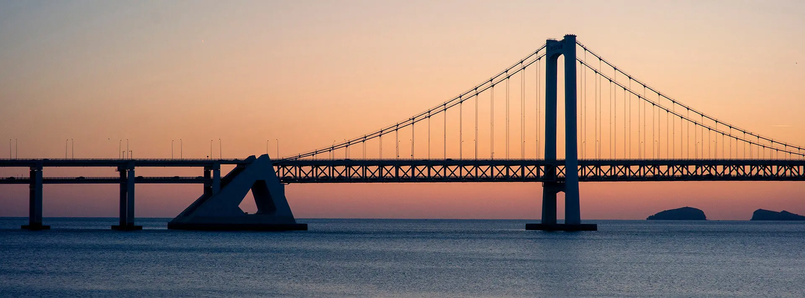
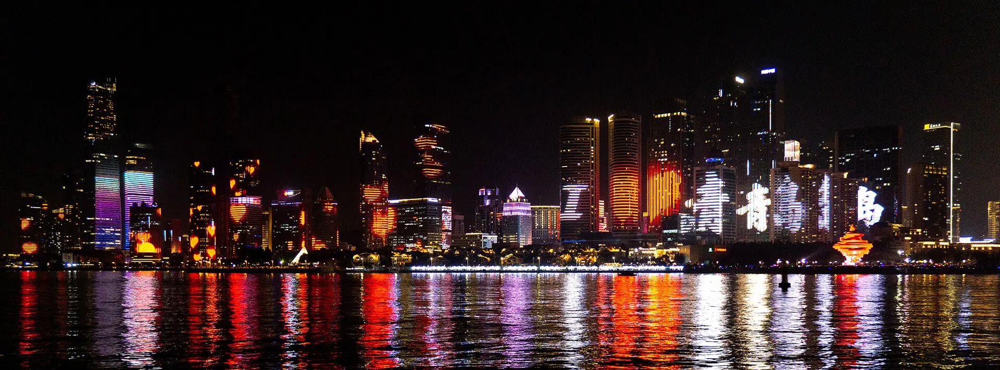
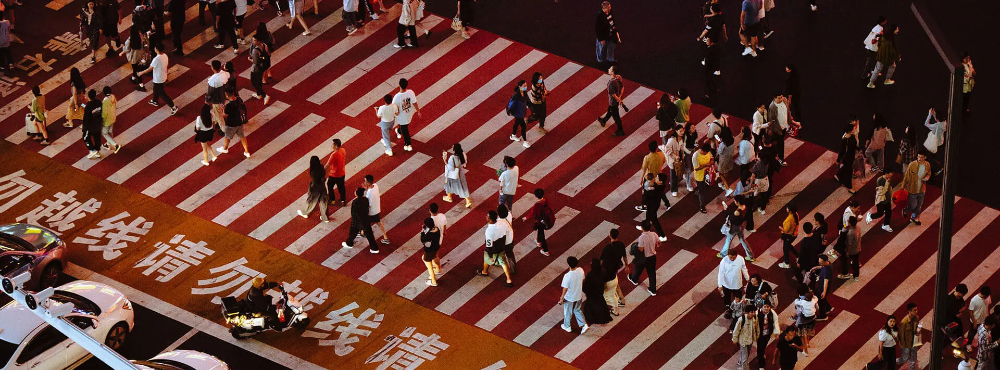

以往每年年度总结写完后的一段时间，我都会忍不住思考，明年的要写成什么样，今年当然也不例外。我早已江郎才尽，早已听不见内心的声音，早已难将那些心绪捋成长段，如同诗歌。可今年无论是生活还是学业，对我来说都如同天翻地覆，以至于在这一年将尽之际，我发现我甚至还没想好该如何动笔。

可总要写点什么吧，哪怕打乱了一年的足迹，哪怕是没有意义的自省，哪怕只是作为对内心的回应。

## 想要被爱是为何？

我从来不觉得我是精神力量强大的人。从许多年以前开始，我一直偷偷对身边的人寄予不成熟的期望，希冀着某一天属于自己的幸福来临。它们总在落空，我也逐渐习惯一人，仿佛只要习惯便不再在意。可今年，或许因为前路遥远，或许是万千可能将要收束于一点，我越发动情，越发期待着属于自己的唯一。

<!-- more -->

某个夜晚，在床上说出「我渴望依赖与被依赖」后紧紧抱住另一个人时，尽管当时的我还没有意识到，但至少从那开始，我也有了「众所周知不言而喻的私心」。那段时间里，我一边备考雅思一边依赖着他。在网络空间陪他到半夜，支撑不住睡着后醒来，看着他发来的数十条消息，或许也是一种幸福吧。

记得《铃芽之旅》的结尾让我感触颇深，念叨着「要是能和喜欢的人一起看就好了啊」的我，与他约定，等我在某扇门后找到他。所以我瞒着全世界，和他一起在另一个深夜，再读一遍关于门的升华。当他挡下我企图摸过去的手，转而拍了拍我的头时，我一路上的疲惫都就此消失，而我已成为了幸福本身。

但我们都知道终究不能在一起，幸福不过寥寥幻影。我匆匆忙忙地别离，甚至来不及留下一张照片、一些回忆。「我想得太久，却来了又走；毕恭毕敬，诚惶诚恐。」

好在那些夜里所说、希望他具备的勇敢，最后也从话语中稍微分了一点给我自己。在植物园、必胜客或者梅溪湖畔，我珍重每次一期一会，勇敢学习脚踏实地。纵然这些相遇都只是人生中的匆匆风景，认识些新的人也不失为一种方式，作为我活过的证明。尽管如此，那些孤身一人度过的夜晚，依旧显得太过漫长。看完数年一度的橘子洲烟花，在情侣堆中独自离开时，我抑制不住地渴望动情，直到说出「还请回应我的心意」，才知晓难以为继。

端午节的那个上午，终于向曾被我依赖的人勇敢地吐露心迹。电话那头传来的声音带着一丝意外与惊讶，在下一句说出的安慰里不见踪影；我的软弱、无助与挣扎，却早已无处遁形。夏日倏忽而逝，我再次孤身一人。ChiliChill 的演唱会上，大声喊出「会想和你重逢」的时候，似乎也有过往的遗憾从内心深处，随泪水一起倾泻而出。

我没有等太久。九月末，借着一次线下面试的机会，我鼓起勇气，邀请某位认识已久却鲜少来往的学长一起吃晚饭，按捺不住对下次见面的期盼。国庆后，我们约在谢子龙影像艺术馆，在「艺术的“地缘政治”」里，探寻我们共通的好奇与意义。

第二天的校友聚会结束后，尽管知道「这还不足以让我们在一起」，但他还是向我伸出了手。如那么多个梦里一样，我成为幸福的人，在摩天轮上握紧他的手，在气温骤降的周一清晨穿上他的外套，噩梦中惊醒时发现睡在他的怀抱。这段时间过得太快、太充实，以至于我甚至想不到如何记叙，仿佛秋招、课设、未来，在幸福面前都变得无关紧要。

在这短短三个月间，我也感受到了自己的成长。社恐的恋爱中，总有一个人要变得外向，所以我逐渐鼓起勇气，创造对许多地点的初次探访。他同样在以他的方式带我进入他的生活，与他的同事轰趴团建、和他的室友漫步橘洲，也是在一起后的难忘回忆。

恋爱绝不只有美好。生活突然多了彼此需要时间适应，小小的失望与不满也时有发生。幸运的是，我们都有解决问题的勇气和接纳对方的决心，那些因彼此而生的不快总能在坦白后烟消云散。待到夜色浓时，如此渴望被爱的我，总能在另一个人的怀里，依偎后安然入眠，以至于这个学期将要过去时，我甚至不敢想象没有他陪伴的时光。

我们也绝不都是什么好人，都怀着随时离开对方的决心。表白那天，他对我说：「如果你以后去外地随便你分不分手，只是这一年，请让我当好一个男朋友。」我自然不甘示弱。听烦了「分开」的玩笑时，我带着哭腔告诉他：「如果你真的要分开，我绝对不会挽留你。但是这真的不好笑。」

可谁又真舍得分开？不过是难以言表的喜欢。某夜路过医院，开玩笑地问他：「如果我的腿哪一天彻底坏掉只能躺病床上，你怎么办？」「我会离开你的。」

我带了点伤心：「那一天总是要来的，所以我该开始珍惜最后的日子了，是吗？」

而他笑着看我：「可是『总要』没规定多久啊，那就把那一天推迟到我们入土之后吧。」

在那之后，一人返校的夜路上，放声喊出「就这样 随便吧 / 嘲笑我们的孤独吧」时，我其实早已不再害怕孤独。长路漫漫，我与他缱绻缠绵。

## 变得软弱是为何？

春天的风还没吹走新冠的冬，在短暂的好友重聚后，我将我自己抽离，以「一辈子总要说走就走一次吧」「我可不想等我九十岁了再后悔十九岁没做点会后悔的事啊」为借口，逃离了冰凉的家乡，降落在冰凉的大连。

冬日的大连，有着与南方不同的凛冽与温柔。在几乎没有外地游客的、冰封的冬日，我混入本地的人潮，漫步于星海广场，坐在堤坝的尽头感受海鸥或白鸽掠过耳旁，身边人说的词句似懂非懂，时间在海面上波光粼粼。一天将尽时，看着逐渐西沉的夕阳，我脑海里的声音想：「要不，就迎着夕阳奔跑如何？」

于是我看着雕塑在金色的天空中起舞，看着天空色彩渐变，由黄到紫再到蓝。在星海广场旁的海滨木栈道跑上跑下，蹬伤许久未曾活动的脚踝时，辽阔而一望无际的大海，早已抚平我内心的皱纹。

第二天，旅顺五语报站的地铁、分段收费的公交，让我深切感受到了东北城市的模样。与普通东北城市相比，曾经的海军基地及俄、日、苏占区的身份，让旅顺显得格外与众不同。无论是和平纪念碑、斯大林路牌还是旅顺博物馆，都是这座城市历史的痕迹。在没有旅客的冬天，这里显得格外冷清，没有行人济济、仅有寂寥风景，西式风格建筑内藏着的小饭店、建筑旁聚集着老人的菜市场、各式店面暖柜里必不可少的露露，是为数不多的暖意。

带着这份暖意，我去了大连动物园，孤零零地坐在只有我一个人的浪漫之星，透过雾蒙蒙的玻璃远望城市的天际。看马驹隔着栅栏作揖行乞，看长臂猿在玻璃另一侧上下，看小熊猫慵懒地于绿叶掉尽的林中穿行。当我从海之韵公园归来，去喜家德吃一顿在舌尖上绽开鲜香的水饺，离别当日东港笼罩着的浓雾，似乎也是留下遗憾与某日再会的注脚。

从益阳专业实习归来后，趁着某个周末天气尚好，我在直达硬座上一路摇到上海。从上海南到人民广场，相亲角是我对这里的初印象。鼓起勇气在 Apple Store 蹭手表充电器，然后如我所料般望着外滩人来人往。第二天则与上海群友共度，捧起美罗城的喜茶，吃了一顿胜博殿后在百脑汇溜达，还在七宝老街对放满了甜面酱的臭豆腐一惊一乍。最后没来得及吃人生第一顿萨利亚，就要匆匆朝着马上就要错过的硬座出发。

可惜行程匆忙，还有太多地方没来得及造访，只能将期盼封存，留待另一个某日再会。

长沙的另一场面基前日，和另一位好友短暂地重逢后，在这座南方小城道别。这只是一场普通的分离，就像这个城市每天万万次的须臾，不过是生活短暂地按下暂停。我们都有各自的前路，有各自要奔赴的后续。可总有些事情难以忘记，所以那些感情如洪水般涌出的深夜，如此让人珍惜。

但最让我珍惜的，依旧是两年前的那个夏天。我不能超越写下 [那些文字](https://blog.rachelt.one/articles/2021-2022/#%E5%A4%8F%EF%BC%9A%E5%87%A1%E8%BF%BD%E6%82%94%E8%8E%AB%E5%8F%8A%E4%B9%8B%E7%89%A9%E7%9A%86%E7%BE%8E%E4%B8%8D%E8%83%9C%E6%94%B6) 的自己，不曾拥有那么珍贵的回忆。我不再如梦幻泡影，往昔珍宝却逐渐远离，连带着曾经不可撼动的、想要牢牢握住生命的原因。

可一旦我望向自己，又会觉得我始终如一。我依然活在无悔的温柔里，渴望着被人珍惜。我依然用文字描摹自己，固执地顾此失彼。我依然还能感受到那座城市的气息，嘲笑着我愚不可及，竟早已失去同行的权利，竟从未听见内心的浅吟：

青岛，青岛。

再没有人会与我形影不离，再没有人抵得上那次魂牵梦萦。再来不及之前，让我再一次拥抱你。

又一次冲进云海后抵达青岛，终究见不到记忆里的模样。广阔依旧，格调依旧，身影依旧，只是那种追悔莫及荡然无存。那个摇曳的夏天只属于回忆，我却总在回忆留存的碎片里，拼凑如此软弱的自己。那片海洋此刻仍摇曳着微弱的光，可今年的夏天结束后，我才终于意识到，越是企图铭记就越容易遗忘。回忆融入静谧的夜色，一如海洋。

## 我的温柔啊——

今年以来，我的创作设备逐步升级。越来越频繁地按下快门时，我也频繁地思考一个问题：「我的创作有何意义？」

写下《在时代中心呼唤艺术》时，刚读完《摄影小史》的我，打心底里不相信纪实摄影师的说辞。我喜欢在城市里漫游，用相机拍下触动我的某一瞬间，其中大多是普通人努力生活的定格，可它们有何意义？我拍下那么多照片，对它们精挑细选，细致地进行后期，只为了将它们打包塞进相册里，然后便从此忘记，连翻看都想不起。我更像名利场里的现代艺术家，拍摄别人的苦难，却对活在苦难中的人毫无益处，只能获得自己的满足。

年初听家母描述过她在一些村镇指导留守孩子的见闻，具体内容已经记不太清，只剩依稀的印象，比如一年到头换不了几件衣服、吃不了几顿饱饭，还只能和隔代长辈相依为命。尽管我们早已战胜明面的赤贫，但像这样在生活里挣扎的人加在一起，就是月收入甚至不到 1000 元的那 6 亿。

我能做什么呢？我什么都做不了。某次家父随家母下乡，看到一户人家的清贫，掏出百元大钞就要为他们改善生活，被当即制止：「单纯施舍一点用都没有，先不说到处都是这样的人家，滋长小孩子对不劳而获的期盼更是相当于间接毁了他们。」这话说得一点没错，那些努力活成普通人的人，谁又喜欢被贴上弱势群体的标签，被凝视被孤立的感觉？

可连百元大钞都掏不出的我，着实不喜欢这种无力感。说来讽刺，享受着比大部分人都要丰裕的物质生活的我，每次看到投身欠发达地区的医生、老师时都会思考，自己又做了什么真能帮上别人的事呢？于是慨叹自己的无力与自私，接着没过多久便抛在脑后，继续享受自己的物质生活，仿佛无力感本身有什么用一样。

我没用，无力感也没用。当然自省也没用，它不过是一种空虚的自我感动。

诚然，独善其身永远是第一要务，然后才是兼济天下。为自己力所完全不能及的事情唉声叹气，也只能是枉费心机。而此时此刻，我又能做到什么呢？

这样想的我，选择努力让自己变得温柔。不视任何事为理所当然，拒绝标签、歧视、优越感，尊重每个不同的存在，耐心地推心置腹。无法否认，这是一种从内心上占领某种「道德高地」的办法，我也不太喜欢「温柔」这个词。它被滥用得太多，以至于让我感觉有点标签，有点刻意，也有点伪善。

自夸的方式很多，做好自己很难。

万幸，我始终友好地对待每个旁人。我没有万贯家财，也难以救民济世，我只能作为一个普通人，在那些努力生活的瞬间里，努力与人为善。高高在上的施舍固不可取，可如果我碰巧没吃饱，看到顶着寒风卖烧饼的摊贩，那么接过烧饼时互道「谢谢」露出的笑容，纵然是微不足道的自我感动，至少不是无动于衷。

万幸，我始终选择向在乎的人伸出手。那个曾需要我照顾、曾让我说出「让我成为他的光」的人，如今仍有我陪在身旁。抗拒的事情太多，以至于某一天，当我发现他的微信头像换成了我拍下的他时，终于感叹我的努力不再是虚妄，我们都在向着生活前进。

暑假的某一天，我们喝咖啡时无意间聊到了过去的同学与未来。「我是大部分同学都记不起来了，十年后估计也没人记得我，记得的也找不到了。」他叹气。「可是还有我啊，」我笑着摸了摸他的头，「还有 K 呢，在哪里我们都会找到你。」

国庆后，家母在长沙住了一周院。她在我心目中一直是坚强且刚毅的人，从小到大都是家里的主心骨，带着家里从清贫走向富足，张罗和决策家中的大小事务。尽管近年来她在慢慢变老，在我心目中她始终高大。

可是手术那天，我和家父焦急地看着大屏上不变的「术后」，本该早已结束，却始终等不到广播。过了不知多久，她终于被从麻醉恢复室里推出来，一身沉重、面无血色，不过好在并无大碍，只是身体虚弱、苏醒过长。我把她抱上病床，握紧她冰凉的手，忍住眼泪陪她度过术后最初的康复期。至此我才意识到，高大的家母早已迈入中年，接下来，就该由我关心她和家父了。

万幸，我始终希望成为透明、温暖、坚定的自己。即便扭曲的本性无法改变，我的心还未放弃呐喊。某个农历十五，当我深夜从地铁站走回宿舍，抬头看见一轮明月，才想起那句「哪怕相隔遥远，也愿你如今，不要遗忘月光」；这或许才是我想成为的模样。有时不会记得，但总有那些夜里，明月高悬。

## 至今仍诅咒着我。

上半年和某位学长一起回学校时曾听他说，大学四年就是一个不可逆转的世界线收束过程。如他所说，我也深感这已结束的三年半，从迷茫到清晰再到走上确定的道路，的确是无穷可能性的逐渐坍缩。

不变的是我依旧不喜欢化学。上半年遇到了一位和大部分同学非常不对付的老师，开始接触这个专业的实际工作环境，扯掉了最后一点遮羞布后，我已经再不能假装还对化学有任何幻想，也开始思考自己究竟要如何使用时间。

就像去年忙于竞赛时那样，今年我的答案是摄影。将标准放宽至及格，放低对自己的期望，人生瞬间开阔。闲暇时举着相机在城市漫游之余，若上课会让我感到不快，我会沉浸于那些硬核却远比上课有意思的技术文章。我研究色彩的分布、编码的秘密，即便一知半解，至少时间花在感兴趣也用得到的事情，便不觉得浪费。

不变的是我依旧沿着技术的路向前，解决技术问题的兴奋是持久的鼓舞。上半年 Pixel 6 Pro 到手，深感 Google 在相机方面的退步，遂精调 Google Camera 的计算库，还开始研究 Zygisk 与 Xposed。年末，我发现从图片转制 CIE 1931 的色谱图并没有想象中那么复杂，不过是一些矩阵魔法，从而开始如痴如醉地研究色谱与绘图。

在那之间，「互联网寒冬」的秋招，从七月末开始努力的我，终于找到了梦寐以求的工作。这场寒冬里，非计算机科班生几乎全程处处碰壁。大部分时候筛选系统会直接拦截化学专业，无论简历多么充实。即便能够进入面试，那些拷问也让我举步维艰。这段时间，我的精神状况也在不断恶化，害怕毕业时无路可走，害怕 HR 突然打来的电话，更害怕 HR 不打电话。打开电脑力扣，关上电脑牛客，看着别人上岸的激动，我独自辗转反侧。

精神有所寄托后，似乎也有了安全感。噩梦中惊醒时抱紧身边熟睡着的他，如此不再害怕。这一切总会过去的。暑假时家母开导我时，我说人生目标是攒够钱了去海边开个咖啡店做点精致的咖啡，她：「那没什么好担心的，要去现在就可以吧？」当时的我还有所犹豫，可那些在心上人身侧醒来的早晨，好像只要能和他在一起，世俗的标准、旁人的眼光，我已不再在意。

如此终于松弛。十一月时恍如梦寐，有一家公司不仅从池子里捞出一个我，还一路快进到了给我发放 offer。公司开得很高，我也没有选择，本不该有怨言，可它在北京。北京意味着荒凉的大平原，意味着没有绿意的冬季，意味着陡增的生活成本，意味着异地。

我害怕异地，也害怕上班后或许会变得麻木的自己。闺蜜告诉我，她室友的男朋友上班后「眼神里没了光」，我不想活成那样。所谓人生目标不过是和心上人白头偕老，我却在目标达成一半时奔逃。这或许正确，但不一定好。也许把握这次机会才能成为更好的自己，也许相隔千里会成为心与心之间的障壁。我不想像 Mia 和 Sebastian 那样，数年后只能匆匆一瞥，幻想如果当初，万般遗憾。谁又知道呢？

谁都不知道，我只能沿着自己的选择前进。

这么多年来，我站在无数个岔路口做过无数次选择，回首时或许会有遗憾与可惜，但从不曾后悔。我深信着，如果认为成长是一个变得明智的过程，那么在每一个岔路口，一定都是当时最明智的自己，做出的最好决定。也许有情况没考虑周详，或者有错误本应被避免，可当时的我一定有当时的原因，我也无法带着现时的经历与眼界，改变已经发生的事实。

所以对我来说，面对人生最好的办法，是相信过去。过去塑造了现在，现在则要把握未来。站在又一个岔路口却不再彷徨，我坚定地向着内心指引的前方。